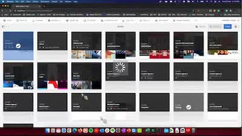

# [!DNL Experience Manager] Skill Builder-Aufzeichnungen

Willkommen bei der Startseite der Adobe [!DNL Experience Manager] Skill Builder-Aufzeichnungen mit aufgezeichneten Webinaren, die der Erweiterung Ihres Wissens und der Maximierung Ihrer Investition in Adobe [!DNL Experience Manager] dienen sollen.

## Neue Funktionen

<table>
<tr>
  <td>
    
    

      <a href="https://experienceleague.adobe.com/de/docs/experience-manager-skill-builder/skill-builder/2020/asset-link">
    <strong>[!DNL Asset Link]</strong>
    </a>
    

    

    <em>[!DNL Asset Link] ist Ihre native Verbindung mit Adobe Creative Cloud.</em>
    

  </td>
  <td>
    
    

    <a href="https://experienceleague.adobe.com/de/docs/experience-manager-skill-builder/skill-builder/2020/brand-portal">
<strong>Brand Portal</strong>
</a>
    

    

    <em>Einfache Asset-Freigabe für interne und externe Teams.</em>
    

  </td>
  <td>
    
     

      <a href="https://experienceleague.adobe.com/de/docs/experience-manager-skill-builder/skill-builder/2020/dynamic-media">
        <strong>[!DNL Dynamic Media]</strong>
      </a>
    

    

    <em>Automatisieren Sie die Ausgabe von Assets für alle Kanäle und Bildschirme.</em>
    

  </td>
</tr>
</table>

>[!TIP]
>
>**Im Navigationsbereich auf der linken Seite finden Sie Aufzeichnungen vorheriger Skill Builder-Ereignisse**.
